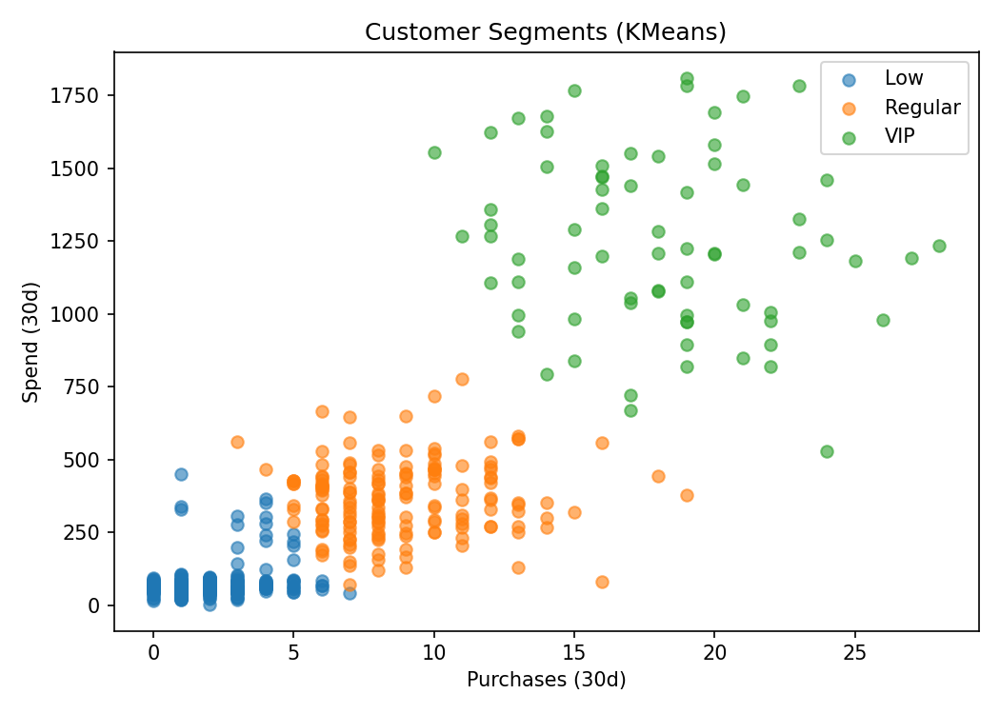

# ml-mini-01-tabular

Production-style mini-projects for tabular ML: training + evaluation + FastAPI inference + Docker + CI.

---

# Mini-project 01 — Tabular Classification

## Goal
Binary classification on tabular data (Breast Cancer Wisconsin dataset).

## Dataset
Breast Cancer Wisconsin (Diagnostic) from scikit-learn.

## Scope
- Baseline model
- Reproducible pipeline
- MLflow tracking

## Run locally

### 1) Create venv
```bash
python3 -m venv .venv
source .venv/bin/activate
pip install -U pip
```

### 2) Install project
```bash
pip install -e .
```

### 3) Train baseline
```bash
python -m mini01.baseline
```

### 4) Run tests
```bash
pytest -q
```

## Baseline Results
- Model: StandardScaler + LogisticRegression
- Split: 80/20 stratified
- Metric: Accuracy
- Test Accuracy: ~0.982

---

# Mini03 — Customer Segmentation (KMeans)

## Goal
Segment customers by behavior (purchases, spend) for marketing actions.

## Model
- Features: `purchases_30d`, `spend_30d`
- Pipeline: StandardScaler + KMeans (k=3)
- Silhouette score ≈ 0.623

## Segments
- VIP → high purchases & spend
- Regular → medium activity
- Low → low activity

## Visualization


---

# Mini03 — FastAPI Service

## Endpoints
- `GET /health`
- `POST /segment`

## Run locally

### Generate artifacts
```bash
python -m mini03.train
```

### Start API
```bash
uvicorn mini03.api:app --host 0.0.0.0 --port 8003
```

Open:
- http://localhost:8003/health
- http://localhost:8003/docs

### Example request
```bash
curl -X POST http://localhost:8003/segment \
  -H "Content-Type: application/json" \
  -d '{"purchases_30d": 18, "spend_30d": 1200}'
```

---

# Run with Docker

```bash
docker build -t mini03-seg -f Dockerfile.mini03 .
docker run --rm -p 8003:8003 mini03-seg
```

---

# Mini03 UI (Next.js)

```bash
cd apps/mini03-ui
npm install
npm run dev
```

Open:
http://localhost:3000

---

# Development

### Lint
```bash
ruff check .
```

### Tests
```bash
pytest -q
```

---

# CI

GitHub Actions runs:
- ruff
- pytest
- docker build
